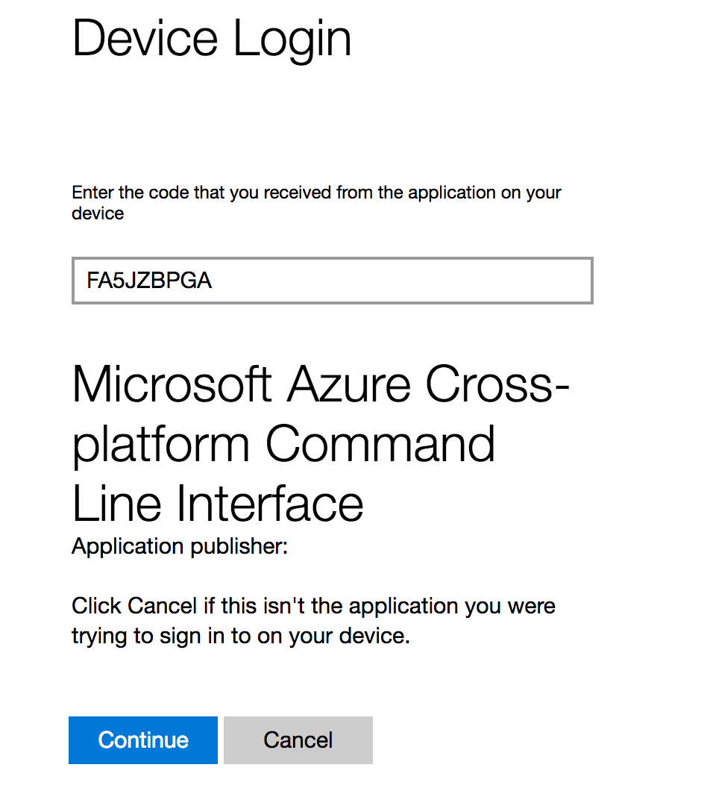

# Provisioning Linux DSVMs with Azure CLI 2.0

**What You'll Need**

+ An Azure Subscription
+ Bash 
  * [Azure Cloud Shell](https://docs.microsoft.com/en-us/azure/cloud-shell/features)
    - The Azure cloud shell provides a complete bash (and powershell) environment. The shell is automatically authenticated with Azure CLI 2.0 so you can provision and run all the scripts listed below using this shell.Shell:
  * [Windows Subsystem for Linux](https://msdn.microsoft.com/en-us/commandline/wsl/install)
    - In addition to WSL, you'll need to install Azure CLI 2.0. See the instructions below or refer to the [Azure CLI 2.0](https://docs.microsoft.com/en-us/cli/azure/overview).

In this lab you will provision your own **Linux Data Science Virtual Machine (DSVM)**. The DSVM is a virtual machine that contains a large number of data science and machine learning tools preinstalled, including deep learning libraries like CNTK, Tensorflow, Caffe2, PyTorch, Keras, MXNet, and a lot more. 

In this course, we will specifically use the [Ubuntu version](https://docs.microsoft.com/en-us/azure/machine-learning/machine-learning-data-science-dsvm-ubuntu-intro) of the DSVM, since it is the most common distribution for machine learning and data science. Other operating system variants of the DSVM are available in [CentOS](https://docs.microsoft.com/en-us/azure/machine-learning/machine-learning-data-science-linux-dsvm-intro) and [Windows](https://docs.microsoft.com/en-us/azure/machine-learning/machine-learning-data-science-provision-vm) (2012 and 2016 Server Editions).

You can provision, start, and stop the Linux DSVM from the Azure portal itself. You are recommended to take a look at the [Azure portal](https://portal.azure.com/) and learn the interface. However, in this course we will introduce you to the [Azure CLI 2.0](https://docs.microsoft.com/en-us/cli/azure/overview), which is a command-line interface built in Python and available on macOS, Linux, and Windows. Learning a bit about the CLI can greatly improve your productivity with Azure resources, and will allow you to configuration and management scripts into your daily workflow. For Windows 10 users, I highly recommend you install the [Windows Subsystem for Linux](https://msdn.microsoft.com/en-us/commandline/wsl/install_guide) to get a complete `bash` environment on your system. In addition, I use [conemu](https://conemu.github.io/) as my main console, which has a number of nice features including tabbed support for multiple consoles, including Ubuntu Bash, PowerShell and Git Bash.

## Installing and Testing the Azure CLI

Follow the instructions on the [Azure CLI 2.0 webpage](https://docs.microsoft.com/en-us/cli/azure/install-azure-cli) for the latest information on how to install the CLI. Once you have installed the Azure CLI, and added it to your `$PATH`, you should be able to call it from your terminal. 

***NOTE** _If you're using the Azure Cloud Shell, you don't need to install Azure CLI 2.0 or authenticate. All that is already done for you._ Skip to section [Deploying Via a Custom Script](#deploying).

```bash
alizaidi@MININT-C510VH5:~$ which az
/home/alizaidi/anaconda3/bin/az
```

## Login to Your Azure Account

In order to the use the Azure CLI 2.0 to manage and create resources in Azure, you'll need to login to your Azure account:

```bash
alizaidi@MININT-C510VH5:~$ az login
```

This will prompt you to open a browser and activate your session:

```bash
alizaidi@MININT-C510VH5:~$ az login
To sign in, use a web browser to open the page https://aka.ms/devicelogin and enter the code FA5JZBPGA to authenticate.
```



Once you're logged into your account, you can list all the Azure subscriptions assoicated with your account by running `az account list`, and the one you're currently defaulting to using `az account show`:

```bash
alizaidi@MININT-C510VH5:~$ az account show
{
  "environmentName": "AzureCloud",
  "id": "please-dont-steal-my-acount",
  "isDefault": true,
  "name": "Not for you",
  "state": "Enabled",
  "tenantId": "nah",
  "user": {
    "name": "alizaidi@microsoft.com",
    "type": "user"
  }
}
alizaidi@MININT-C510VH5:~$ az account list
[
  {
    "cloudName": "AzureCloud",
    "id": "please-dont-steal-my-acount",
    "isDefault": true,
    "name": "Not for you",
    "state": "Enabled",
    "tenantId": "nah",
    "user": {
      "name": "alizaidi@microsoft.com",
      "type": "user"
    }
  }
]
```

You can use the option `--output table` to print the output in a tabular format.


## <a name="deploying"></a> Deploying Via Custom Script 

Rather than doing this manually, I have created a custom script that will create the DSVM for you, and also run some configuration settings on your VM's network to allow for easier access.

You can simply deploy the DSVM by navigating to the `labs/0-dsvm-deploy-script` directory and running

```bash
alizaidi:$ ./deploydsvm.sh
```

The default parameters will use your bash username as your username for the VM, and a simple password. Feel free to change these by specThis will create your virtual machine, open up all the necessary ports on your VM's network security group, and save the credentials in a text file `creds.txt`.

## Updating DSVM OS Disk Size

By default, your primary partition on the DSVM is only 50 GBs. Fortunately, expanding it is pretty easy. Let's again use two helper scripts I created to make this process trivally easy. Using the `$VMNAME` and `$RG` values saved in the file `creds.txt`, fill in the following command:

```bash
expand-osdisk.sh "os-size-in-GB" "RG" "VMNAME"
```

For example, I'd run

```bash
expand-disk.sh 200 azaididlclass azaididsvm
```

Now you're ready to log into your VM and have some fun!

## Deploying Manually **(Only Proceed if You Didn't Use the Script Above!)**

If you didn't use the scripts above, I've written out the instructions manually below.


### Create a New Resource Group

Resource groups are a convenient way of consolidating related resources together. This is particularly handy when you have a project that will require a variety of Azure resources and you'd like to see them all in one-place.

Please make sure your resource group is in "East US" region (you could potentially use South Central US). 

In this example, I'll create a resource group called `azteachdl` in `eastus`

```bash
alizaidi:$ az group create -n azteachdl -l eastus
{
  "id": "/subscriptions/stay-away-from me/resourceGroups/azteachdl",
  "location": "eastus",
  #"managedBy": null,
  "name": "azteachdl",
  "properties": {
    "provisioningState": "Succeeded"
  },
  "tags": null
}
```

### Create Your DSVM

Now let's create the Linux DSVM. Edit the parameters below with your configurations. In particular, you'll need to specify your own `resource-group` name,  a name for the data science virtual machine, and your username.

```bash
az vm create \
    --resource-group azteachdl \
    --name azdsvmclass \
    --admin-username alizaidi \
    --public-ip-address-dns-name algoclass \
    --image microsoft-ads:linux-data-science-vm-ubuntu:linuxdsvmubuntu:latest \
    --size Standard_NC6 \
    --generate-ssh-keys
```

While the resources are being deployed, you will see a _"Running"_ message displayed in your terminal. Upon completion, you should see an output JSON table with information about your resources:

```bash
{
  "fqdns": "",
  "id": "/subscriptions/keep-away/resourceGroups/azaididlclass/providers/Microsoft.Compute/virtualMachines/azaidi",
  "location": "eastus",
  "macAddress": "00-0D-3A-1B-59-48",
  "powerState": "VM running",
  "privateIpAddress": "10.0.0.4",
  "publicIpAddress": "13.00.000.000",
  "resourceGroup": "azaididlclass"
}
```

### Create a Password for the User

In the scripted solution, the authentication is done through a password.

In the manual setup we showed how you could create a virtual machine using the `generate-ssh-keys` option, which authenticates using SSH keys, which by default are saved as a pair of private and public keys in `~/.ssh/id_rsa` and `~/.ssh/id_rsa.pub`. In order to access certain web applications like Jupyter, we'll need a password for our user. 

To create a password for the user, run the following:

```bash
sudo passwd $USERNAME
```

where `$USERNAME` is the username you used to create the VM.

You can now navigate to the portal and check for your resources.

