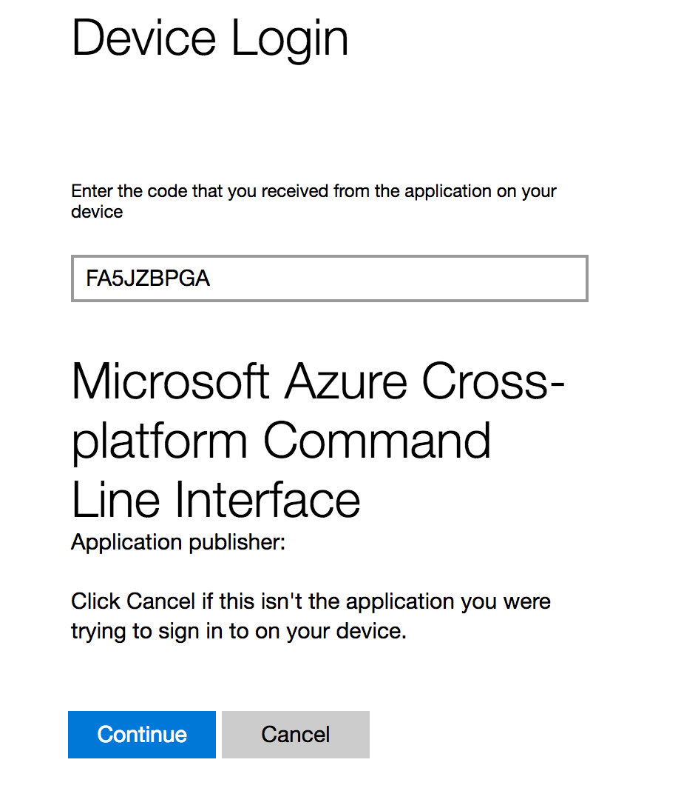

Provisioning Linux DSVMs with Azure CLI 2.0
============================================

**What You'll Need**

+ An Azure Subscription
+ Bash Shell:
  * [Windows Subsystem for Linux](https://msdn.microsoft.com/en-us/commandline/wsl/install_guide)
  * [Git Bash](https://git-for-windows.github.io/)

In this lab you will provision your own **Linux Data Science Virtual Machine (DSVM)**. The DSVM is a virtual machine that contains a large number of data science and machine learning tools preinstalled, including deep learning libraries like CNTK, Tensorflow, Theano, Keras, MXNet. 

In this course, we will specifically use the [Ubuntu version](https://docs.microsoft.com/en-us/azure/machine-learning/machine-learning-data-science-dsvm-ubuntu-intro) of the DSVM, since it is the most common distribution for machine learning and data science. Other operating system variants of the DSVM are available in [CentOS](https://docs.microsoft.com/en-us/azure/machine-learning/machine-learning-data-science-linux-dsvm-intro) and [Windows](https://docs.microsoft.com/en-us/azure/machine-learning/machine-learning-data-science-provision-vm) (2012 and 2016 Server Editions).

You can provision, start, and stop the Linux DSVM from Azure itself. You are recommended to take a look at the [Azure portal](https://portal.azure.com/) and learn the interface. However, in this course we will introduce you to the [Azure CLI 2.0](https://docs.microsoft.com/en-us/cli/azure/overview), which is a command-line interface built in Python and available on macOS, Linux, and Windows. Learning a bit about the CLI can greatly improve your productivity with Azure resources, and will allow you to configuration and management scripts into your daily workflow. For Windows 10 users, I highly recommend you install the [Windows Subsystem for Linux](https://msdn.microsoft.com/en-us/commandline/wsl/install_guide) to get a complete `bash` environment on your system. In addition, I use [conemu](https://conemu.github.io/) as my main console, which has a number of nice features including tabbed support for multiple consoles, including Ubuntu Bash, PowerShell and Git Bash.

## Installing and Testing the Azure CLI

Follow the instructions on the [Azure CLI 2.0 webpage](https://docs.microsoft.com/en-us/cli/azure/install-azure-cli) for the latest information on how to install the CLI. Once you have installed the Azure CLI, and added it to your `$PATH`, you should be able to call it from your terminal. 

```bash
alizaidi@MININT-C510VH5:~$ which az
/home/alizaidi/anaconda3/bin/az
```

## Login to Your Azure Account

In order to the use the Azure CLI 2.0 to manage and create resources in Azure, you'll need to login to your Azure account:

```bash
alizaidi@MININT-C510VH5:~$ az login
```

This will prompt you to open a browser and activate your session:

```bash
alizaidi@MININT-C510VH5:~$ az login
To sign in, use a web browser to open the page https://aka.ms/devicelogin and enter the code FA5JZBPGA to authenticate.
```



Once you're logged into your account, you can list all the Azure subscriptions assoicated with your account by running `az account list`, and the one you're currently defaulting to using `az account show`:

```bash
alizaidi@MININT-C510VH5:~$ az account show
{
  "environmentName": "AzureCloud",
  "id": "please-dont-steal-my-acount",
  "isDefault": true,
  "name": "Not for you",
  "state": "Enabled",
  "tenantId": "nah",
  "user": {
    "name": "alizaidi@microsoft.com",
    "type": "user"
  }
}
alizaidi@MININT-C510VH5:~$ az account list
[
  {
    "cloudName": "AzureCloud",
    "id": "please-dont-steal-my-acount",
    "isDefault": true,
    "name": "Not for you",
    "state": "Enabled",
    "tenantId": "nah",
    "user": {
      "name": "alizaidi@microsoft.com",
      "type": "user"
    }
  }
]
```

You can use the option `--output table` to print the output in a tabular format.


## Deploying Via Custom Script

Rather than doing this manually, I have created a custom script that will create the DSVM for you, and also run some configuration settings on your VM's network to allow for easier access.

You can simply deploy the DSVM by navigating to the `labs/0-dsvm-deploy-script` directory and running

```bash
alizaidi:$ ./deploydsvm.sh
```

The default parameters will use your bash username as your username for the VM, and a simple password. Feel free to change these by specifying your own parameters:


```bash
alizaidi:$ ./deploydsvm.sh batman Gotham3141
```

Take note of the messages produced by the script. You may want to save the output somewhere for reference.


## Create a Password for the User

In the script above, the authentication is done through a password. Look at the script to find out the password.

If you chose the `generate-ssh-keys` option when creating your VM, the SSH user authenticates to the VM using SSH keys, which by default, are saved as a pair of private and public keys in `~/.ssh/id_rsa` and `~/.ssh/id_rsa.pub`. In order to access certain web applications like Jupyter, we'll need a password for our user. 

To create a password for the user, run the following:

```bash
sudo passwd $USERNAME
```

where `$USERNAME` is the username you used to create the VM.


## Create a New Resource Group

Resource groups are a convenient way of consolidating related resources together. This is particularly handy when you have a project that will require a variety of Azure resources and you'd like to see them all in one-place.

Please make sure your resource group is in "East US" region (you could potentially use South Central US). 

In this example, I'll create a resource group called `azteachdl` in `eastus`

```bash
alizaidi:$ az group create -n azteachdl -l eastus
{
  "id": "/subscriptions/stay-away-from me/resourceGroups/azteachdl",
  "location": "eastus",
  "managedBy": null,
  "name": "azteachdl",
  "properties": {
    "provisioningState": "Succeeded"
  },
  "tags": null
}
```

## Create Your DSVM

Now let's create the Linux DSVM. Edit the parameters below with your configurations. In particular, you'll need to specify your own `resource-group` name,  a name for the data science virtual machine, and your username.

```bash
az vm create \
    --resource-group azteachdl \
    --name azdsvmclass \
    --admin-username alizaidi \
    --public-ip-address-dns-name algoclass \
    --image microsoft-ads:linux-data-science-vm-ubuntu:linuxdsvmubuntu:latest \
    --size Standard_NC6 \
    --generate-ssh-keys
```

While the resources are being deployed, you will see a _"Running"_ message displayed in your terminal. Upon completion, you should see an output JSON table with information about your resources:

```bash
{
  "fqdns": "",
  "id": "/subscriptions/keep-away/resourceGroups/azaididlclass/providers/Microsoft.Compute/virtualMachines/azaidi",
  "location": "eastus",
  "macAddress": "00-0D-3A-1B-59-48",
  "powerState": "VM running",
  "privateIpAddress": "10.0.0.4",
  "publicIpAddress": "13.00.000.000",
  "resourceGroup": "azaididlclass"
}
```

You can now navigate to the portal and check for your resources.

